# 🔬 CNN Model for Diatoms Classification

[](https://www.python.org/)
[](https://www.tensorflow.org/)
[](https://keras.io/)
[](https://opencv.org/)
[](LICENSE)

## 📋 Introdução

Sistema avançado de classificação automática de diatomáceas utilizando **Redes Neurais Convolucionais (CNNs)** com **Transfer Learning** baseado na arquitetura **ResNet50V2**. Este projeto implementa uma pipeline completa desde o pré-processamento de imagens até a classificação de gêneros de diatomáceas.

### 🦠 Gêneros Classificados

O modelo é capaz de classificar 5 gêneros de diatomáceas:

1. **Encyonema**
2. **Eunotia**
3. **Gomphonema**
4. **Navicula**
5. **Pinnularia**

### ✨ Características Principais

- 🎯 **Transfer Learning** com ResNet50V2 pré-treinada na ImageNet
- 🖼️ **Pipeline de Pré-processamento** automatizado com IA (rembg)
- 📊 **Data Augmentation** avançado para aumentar a generalização
- ⚖️ **Balanceamento de Classes** usando pesos computados
- 📈 **Métricas Detalhadas**: Matriz de Confusão, ROC-AUC, t-SNE, GradCAM
- 🔄 **Treinamento em Duas Fases**: Feature Extraction e Fine-Tuning
- 💾 **Callbacks Inteligentes**: ModelCheckpoint e EarlyStopping

---

## 📁 Estrutura do Repositório

```
CNN-Model-for-Diatoms-Classification/
│
├── 📂 CNN/                                    # Módulo de treinamento e avaliação
│   ├── config.py                              # Configurações (IMAGE_SIZE=400, BATCH_SIZE=32)
│   ├── model_builder.py                       # Construção do modelo (Feature Extraction e Fine-Tuning)
│   ├── data_pipeline.py                       # Pipeline de dados com augmentation
│   ├── evaluate_model.py                      # Script de avaliação completa
│   ├── predict.py                             # Script de predição para novas imagens
│   ├── get_predictions.py                     # Geração de predições
│   ├── plot_confusion_matrix.py               # Plotagem da matriz de confusão
│   ├── plot_gradcam.py                        # Visualização GradCAM
│   ├── plot_training_curves.py                # Curvas de treinamento (loss/accuracy)
│   ├── plot_tsne_visualization.py             # Visualização t-SNE
│   ├── ROC_AUC_curves.py                      # Curvas ROC-AUC por classe
│   ├── clean_terminal.py                      # Utilitário para limpar terminal
│   ├── drive_colab.py                         # Integração com Google Drive/Colab
│   │
│   └── 📂 models/                             # Modelos treinados e resultados
│       ├── 📂 modelo_7k/                      # Modelo treinado com ~7.000 imagens
│       │   ├── 📂 feature_extraction_model_7k/
│       │   └── 📂 fineTuned_model_7k/
│       ├── 📂 modelo_10k/                     # Modelo treinado com ~10.000 imagens
│       │   ├── 📂 feature_extraction_Model_10k/
│       │   └── 📂 fineTuned_model_10k/
│       └── 📂 modelo_22k/                     # Modelo treinado com ~22.000 imagens
│           ├── 📂 feature_extraction_model_22k/
│           └── 📂 fineTuned_model_22k/
│
├── 📂 pipeline_tratamento/                    # Módulo de pré-processamento de imagens
│   ├── main.py                                # Menu principal do pipeline
│   ├── pipeline_tratamento.py                 # Pipeline completo de tratamento
│   ├── segmentacao_com_ia.py                  # Segmentação usando IA (rembg)
│   ├── recortar_img.py                        # Ferramenta de recorte manual
│   ├── tratar_img_cortada.py                  # Tratamento de imagem individual
│   ├── tratar_Pasta.py                        # Tratamento em lote (pasta)
│   ├── processa_img.py                        # Processamento de imagem
│   ├── carregar_imagem.py                     # Carregamento de imagens
│   ├── salva_img.py                           # Salvamento de imagens
│   ├── ferramenta_selecao.py                  # Ferramenta de seleção ROI
│   ├── mouse_callback.py                      # Callback de mouse para seleção
│   ├── estado_selecao.py                      # Estado da seleção ROI
│   ├── menu_genero.py                         # Menu de seleção de gênero
│   ├── obter_caminhos.py                      # Obtenção de caminhos de arquivos
│   ├── mover_img_original.py                  # Movimentação de imagens originais
│   ├── removerAug.py                          # Remoção de augmentations
│   └── limpar_terminal.py                     # Limpeza do terminal
│
├── requirements.txt                           # Dependências Python do projeto
├── setup.sh                                   # Script de instalação (Linux/macOS)
├── setup.bat                                  # Script de instalação (Windows)
├── .gitignore                                 # Arquivos ignorados pelo Git
├── .gitattributes                             # Atributos do Git
└── README.md                                  # 📖 Este arquivo
```

---

## 🚀 Como Rodar o Projeto

### 3.1 📥 Instalação

Clone o repositório:

```bash
git clone https://github.com/ClemersonCristiano/CNN-Model-for-Diatoms-Classification.git
cd CNN-Model-for-Diatoms-Classification
```

#### 🐧 Linux (recomendado: usar o script de setup)

O projeto utiliza `tkinter` para as janelas de seleção de arquivo. No Linux essa dependência **não vem incluída no Python** e precisa ser instalada separadamente via gerenciador de pacotes do sistema (`apt-get`).

O script `setup.sh` cuida de tudo automaticamente: verifica e instala o `python3-tk`, cria o ambiente virtual e instala as dependências Python:

```bash
chmod +x setup.sh
./setup.sh
```

Após o setup, ative o ambiente virtual:

```bash
source venv/bin/activate
```

#### 🍎 macOS (recomendado: usar o script de setup)

No macOS o `tkinter` já está incluído no Python. O `setup.sh` cria o ambiente virtual e instala as dependências:

```bash
chmod +x setup.sh
./setup.sh
```

Após o setup, ative o ambiente virtual:

```bash
source venv/bin/activate
```

#### 🪟 Windows (recomendado: usar o script de setup)

No Windows o `tkinter` já está incluído no Python. Execute o `setup.bat` no Prompt de Comando (CMD):

```bat
setup.bat
```

Após o setup, ative o ambiente virtual:

```bat
venv\Scripts\activate
```

> ⚠️ **Nota:** Este projeto requer Python 3.8+. No Windows, certifique-se de instalar o Python pelo [instalador oficial](https://www.python.org/) marcando a opção **"tcl/tk and IDLE"**.

---

### 3.2 🖼️ Pipeline de Pré-processamento

O pipeline de pré-processamento permite preparar as imagens de diatomáceas antes do treinamento:

```bash
cd pipeline_tratamento
python main.py
```

#### 🎯 Opções do Menu Principal:

- **[s]** - **Recortar Imagem**: Ferramenta interativa para recortar região de interesse (ROI)
- **[d]** - **Tratar Imagem Individual**: Processar uma única imagem já recortada
- **[p]** - **Tratar Pasta**: Processar todas as imagens de uma pasta em lote
- **[q]** - **Sair**: Encerrar o programa

#### 🔄 Pipeline de Tratamento:

1. **Segmentação com IA** (`rembg`): Remoção automática do background usando deep learning
2. **Remoção de Background**: Limpeza adicional e refinamento
3. **Suavização**: Aplicação de filtros para redução de ruído
4. **Redimensionamento**: Ajuste para 400×400 pixels (tamanho padrão do modelo)

---

### 3.3 📊 Estrutura do Dataset

Organize seu dataset na seguinte estrutura:

```
dataset/
├── Encyonema/
│   ├── img001.png
│   ├── img002.png
│   └── ...
├── Eunotia/
│   ├── img001.png
│   ├── img002.png
│   └── ...
├── Gomphonema/
│   ├── img001.png
│   ├── img002.png
│   └── ...
├── Navicula/
│   ├── img001.png
│   ├── img002.png
│   └── ...
└── Pinnularia/
    ├── img001.png
    ├── img002.png
    └── ...
```

> 📝 **Importante:** Cada pasta deve conter apenas imagens do respectivo gênero. O nome da pasta é usado como label.

---

### 3.4 🏋️ Treinamento

Para treinar um novo modelo:

```bash
cd CNN
python model_builder.py
```

#### ⚙️ Configurações em `config.py`:

```python
IMAGE_SIZE = 400        # Tamanho das imagens (400×400)
NUM_CHANNELS = 3        # Canais RGB
BATCH_SIZE = 32         # Tamanho do batch
AUTOTUNE = tf.data.AUTOTUNE  # Otimização automática do TensorFlow
LAST_CONV_LAYER = 'resnet50v2'  # Nome da última camada convolucional (para GradCAM)
```

#### 📚 Fases do Treinamento:

1. **Feature Extraction** (Fase 1):
   - Camadas da ResNet50V2 congeladas
   - Treina apenas as camadas superiores (classificador)
   - Aprendizado rápido das features específicas do dataset
   - Épocas: ~10-20

2. **Fine-Tuning** (Fase 2):
   - Descongela as últimas camadas da ResNet50V2
   - Ajuste fino dos pesos para o domínio específico
   - Taxa de aprendizado reduzida (evita destruir features aprendidas)
   - Épocas: ~20-30

#### 🔔 Callbacks Utilizados:

- **ModelCheckpoint**: Salva automaticamente o melhor modelo baseado em `val_accuracy`
- **EarlyStopping**: Para o treinamento se não houver melhoria após 5 épocas (`patience=5`)

---

### 3.5 📈 Avaliação

Para avaliar um modelo treinado:

```bash
cd CNN
python evaluate_model.py
```

#### 📊 Métricas Geradas:

1. **Matriz de Confusão** (`confusion_matrix_*.png`):
   - Visualiza acertos e erros por classe
   - Identifica confusões entre gêneros

2. **Curvas ROC-AUC** (`roc_auc_curves_*.png`):
   - Uma curva por gênero (One-vs-Rest)
   - AUC próximo a 1.0 indica excelente discriminação

3. **Visualização t-SNE** (`tsne_visualization_*.png`):
   - Redução dimensional 2D das features extraídas
   - Mostra separabilidade das classes no espaço de features

4. **Curvas de Treinamento** (`training_curves_*.png`):
   - Loss e accuracy para treino e validação
   - Identifica overfitting/underfitting

5. **GradCAM** (via `plot_gradcam.py`):
   - Mapas de ativação visual
   - Mostra quais regiões da imagem influenciam a predição

---

### 3.6 🔮 Predição

Para fazer predições em novas imagens:

```bash
cd CNN
python predict.py
```

#### 🛠️ Configuração:

Edite o arquivo `predict.py` para configurar:

```python
IMAGE_PATH = "caminho/para/sua/imagem.png"
MODEL_PATH = "models/modelo_22k/fineTuned_model_22k/Diatom_Classifier_FineTuned_Model_22k.keras"
```

O script retornará:
- **Classe Predita**: Gênero identificado
- **Probabilidades**: Distribuição de probabilidade para cada classe
- **Confiança**: Percentual da predição

---

## 📊 Resultados dos Modelos

### 🏆 Modelo 7k (~7.000 imagens)

**📂 Localização:** `CNN/models/modelo_7k/`

#### 📸 Imagens de Avaliação:

<table>
<tr>
<td align="center">
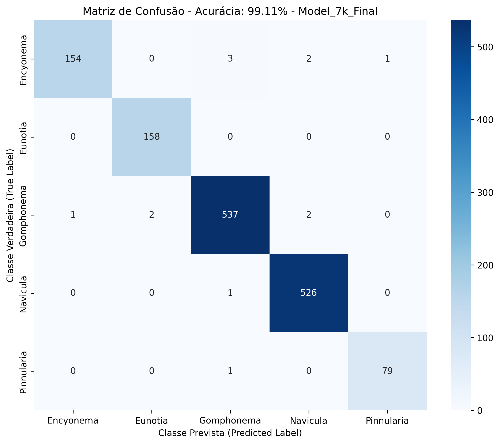
<br />
<b>Matriz de Confusão</b>
</td>
<td align="center">
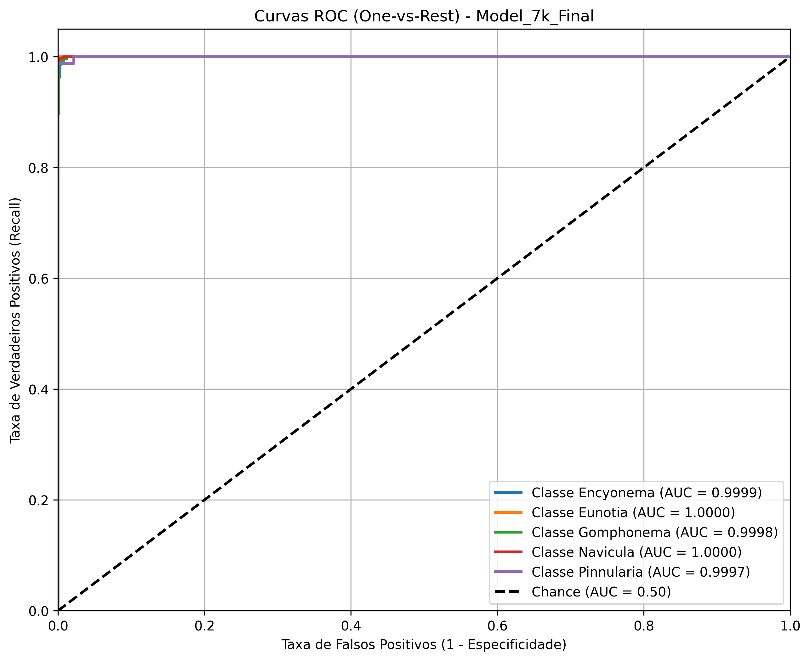
<br />
<b>Curvas ROC-AUC</b>
</td>
</tr>
<tr>
<td align="center">
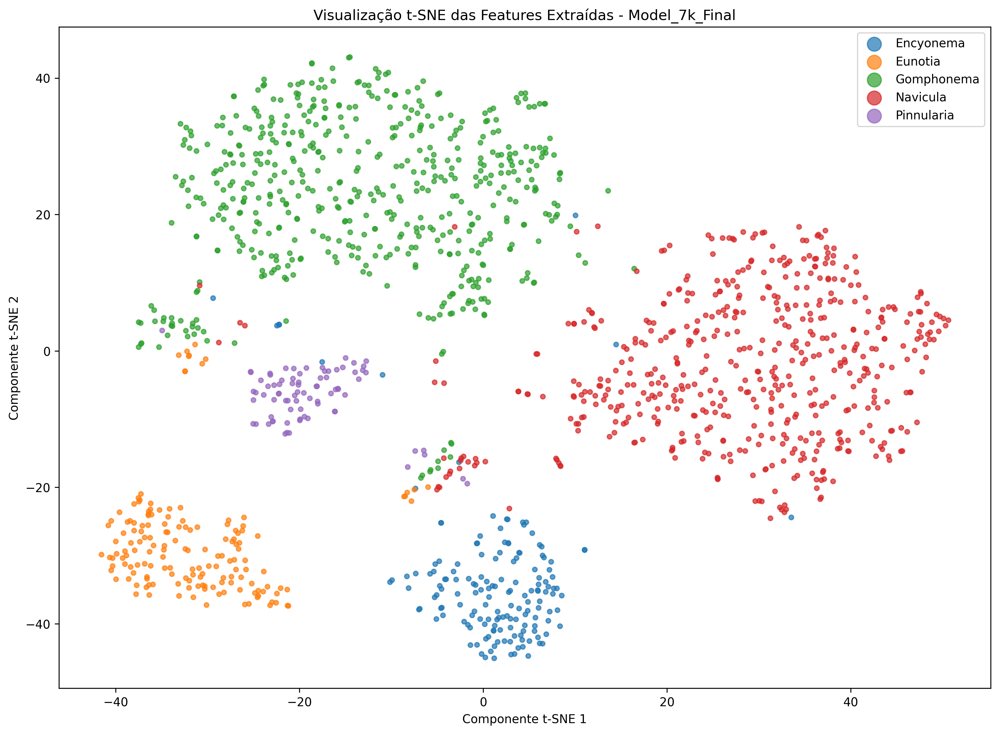
<br />
<b>Visualização t-SNE</b>
</td>
<td align="center">
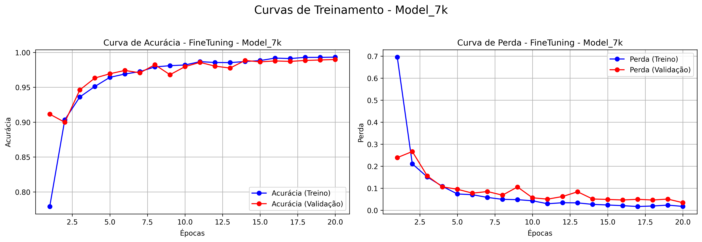
<br />
<b>Curvas de Treinamento</b>
</td>
</tr>
<tr>
<td align="center" colspan="2">
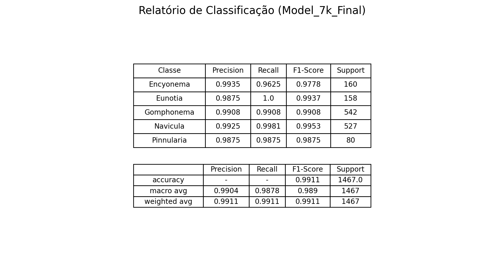
<br />
<b>Relatório de Classificação</b>
</td>
</tr>
</table>

#### 📦 Arquivos do Modelo:

- `feature_extraction_model_7k/Diatom_Classifier_Feature_Extraction_Model_7k.keras`
- `fineTuned_model_7k/Diatom_Classifier_FineTuned_Model_7k.keras`

---

### 🏆 Modelo 10k (~10.000 imagens)

**📂 Localização:** `CNN/models/modelo_10k/`

#### 📸 Imagens de Avaliação:

<table>
<tr>
<td align="center">
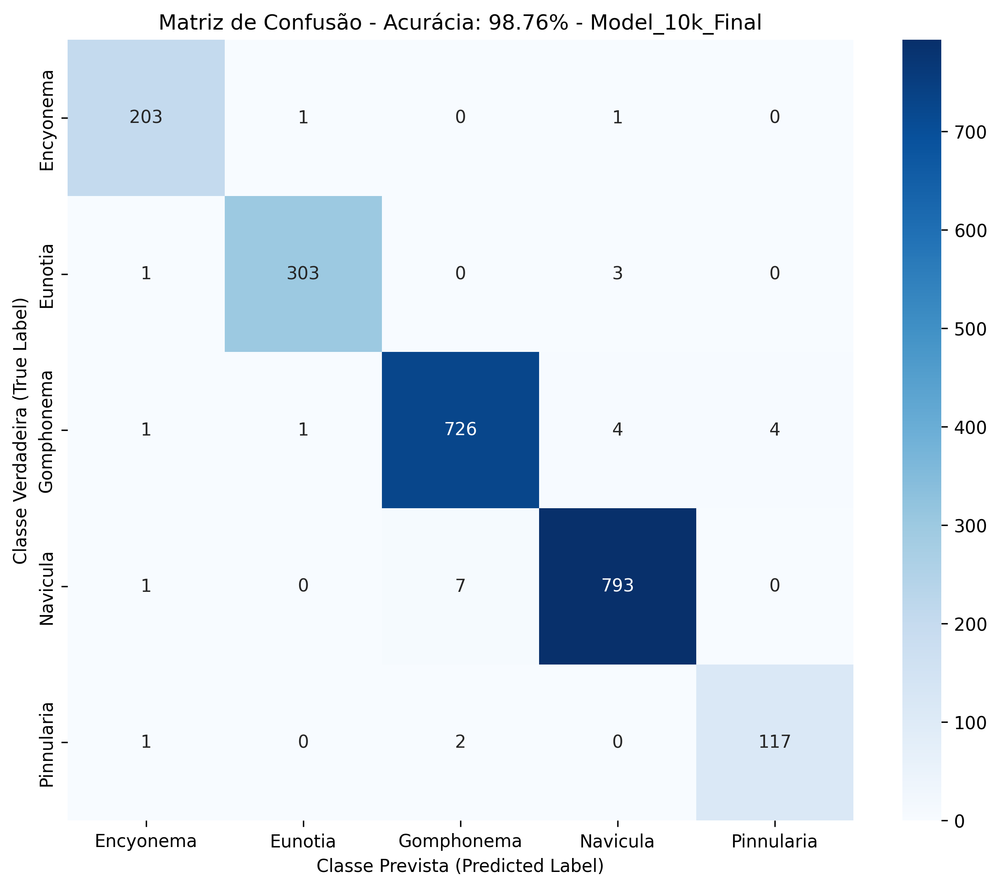
<br />
<b>Matriz de Confusão</b>
</td>
<td align="center">
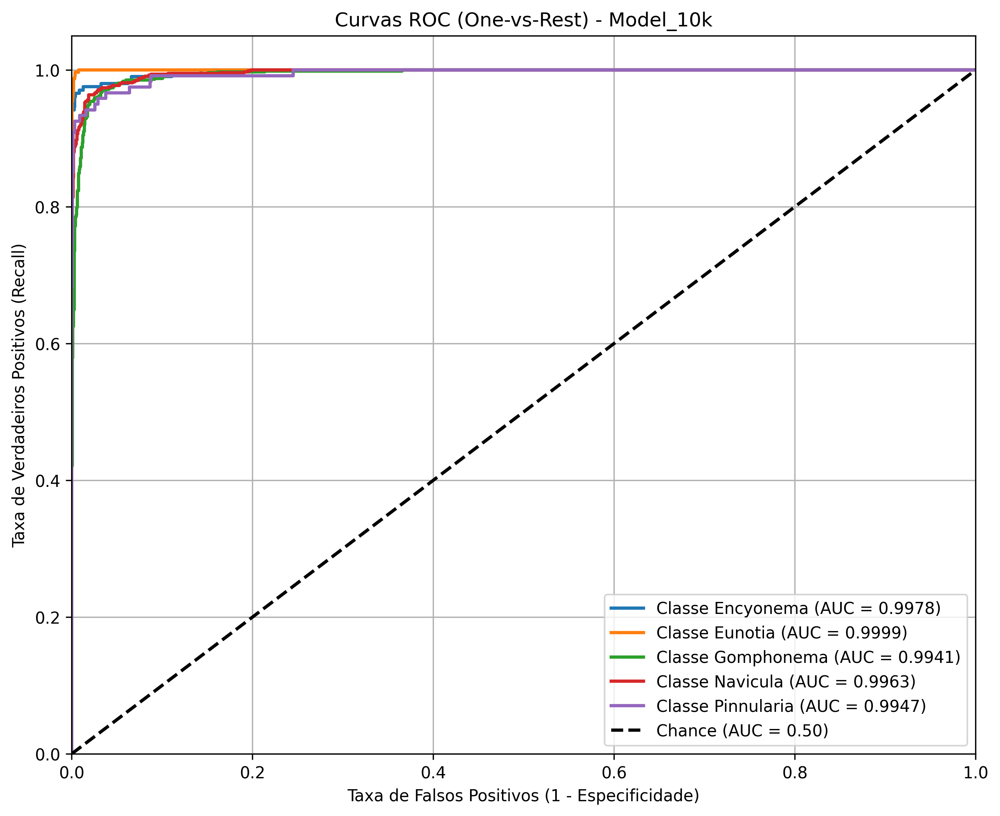
<br />
<b>Curvas ROC-AUC</b>
</td>
</tr>
<tr>
<td align="center">
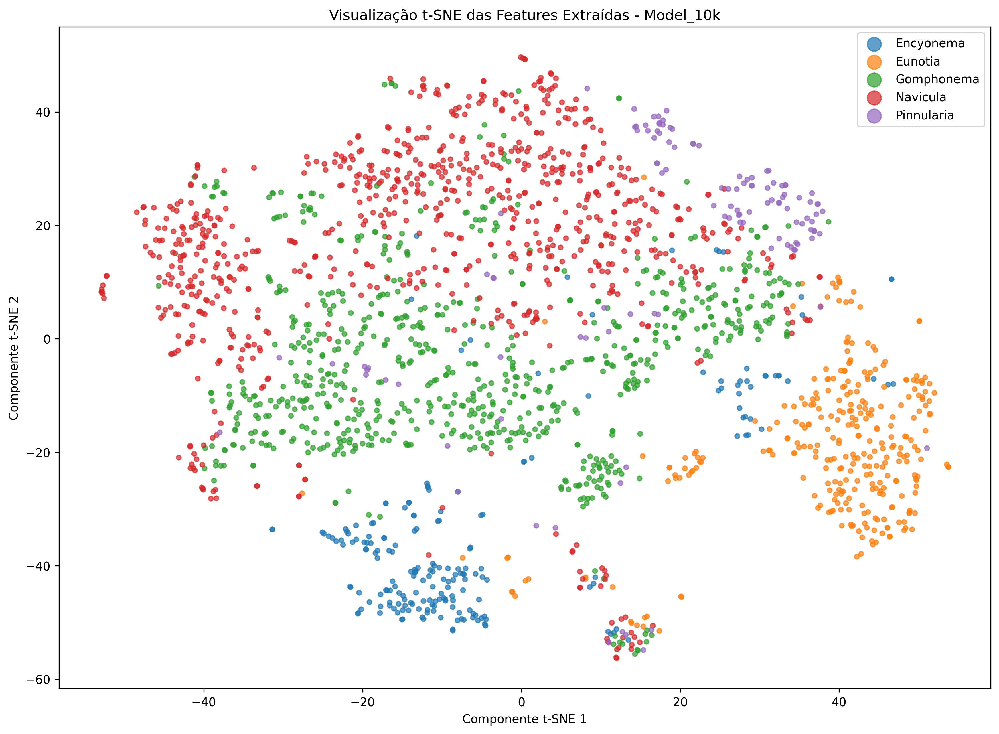
<br />
<b>Visualização t-SNE</b>
</td>
<td align="center">
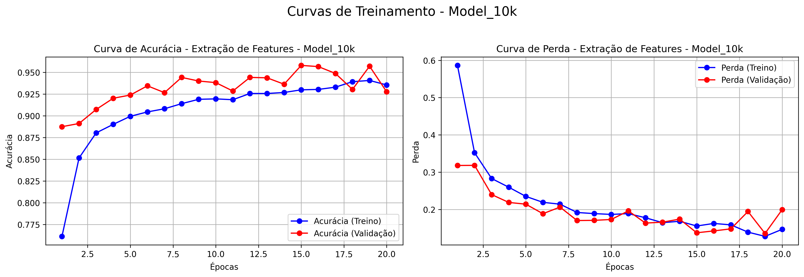
<br />
<b>Curvas de Treinamento</b>
</td>
</tr>
<tr>
<td align="center" colspan="2">
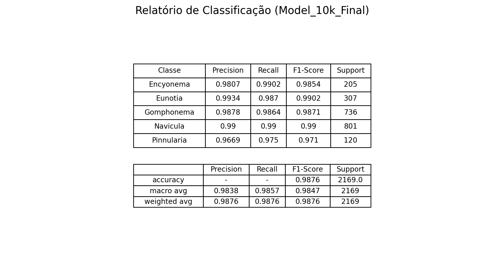
<br />
<b>Relatório de Classificação</b>
</td>
</tr>
</table>

#### 📦 Arquivos do Modelo:

- `feature_extraction_Model_10k/Diatom_Classifier_Feature_Extraction_Model_10k.keras`
- `fineTuned_model_10k/Diatom_Classifier_FineTuned_Model_10k.keras`

---

### 🏆 Modelo 22k (~22.000 imagens)

**📂 Localização:** `CNN/models/modelo_22k/`

#### 📸 Imagens de Avaliação:

<table>
<tr>
<td align="center">
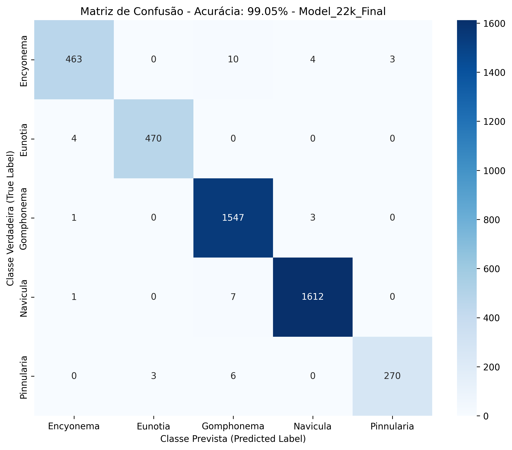
<br />
<b>Matriz de Confusão</b>
</td>
<td align="center">
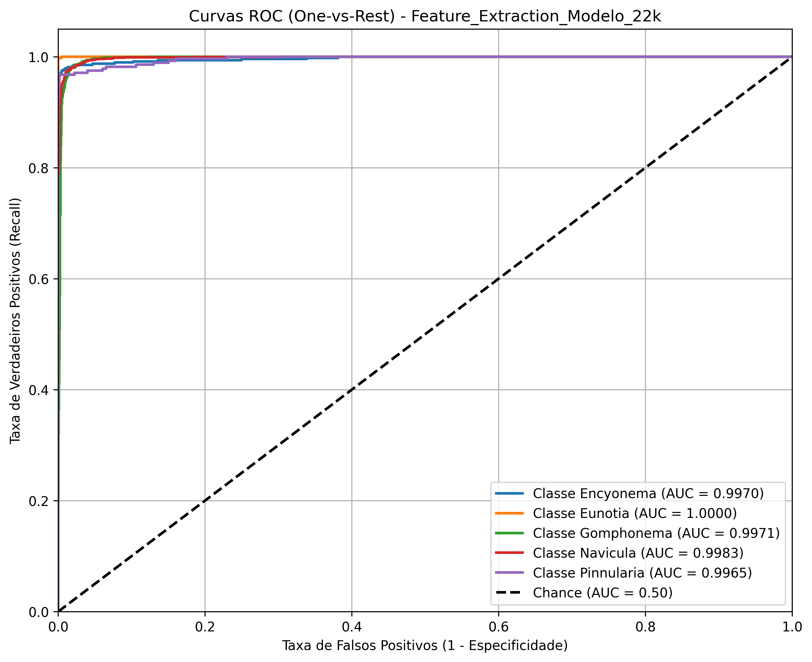
<br />
<b>Curvas ROC-AUC</b>
</td>
</tr>
<tr>
<td align="center">
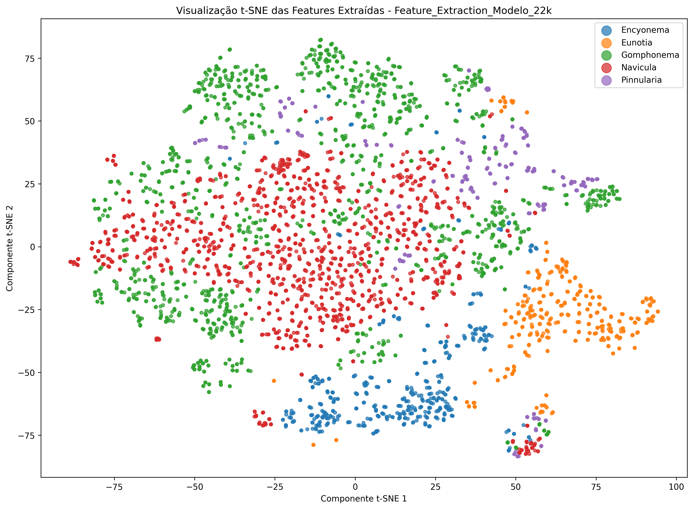
<br />
<b>Visualização t-SNE</b>
</td>
<td align="center">
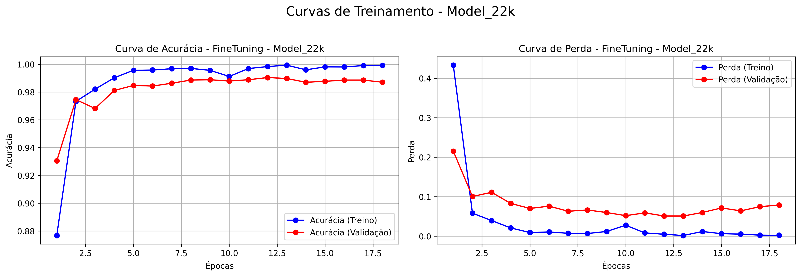
<br />
<b>Curvas de Treinamento</b>
</td>
</tr>
<tr>
<td align="center" colspan="2">
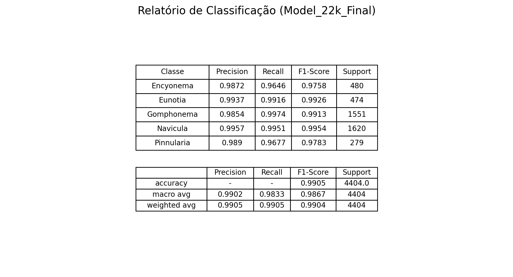
<br />
<b>Relatório de Classificação</b>
</td>
</tr>
</table>

#### 📦 Arquivos do Modelo:

- `feature_extraction_model_22k/Diatom_Classifier_Feature_Extraction_Model_22k.keras`
- `fineTuned_model_22k/Diatom_Classifier_FineTuned_Model_22k.keras`

---

## 🔍 Interpretação dos Resultados

### 📊 Matriz de Confusão

A matriz de confusão mostra a performance do modelo para cada classe:

- **Diagonal Principal** (valores em destaque): Classificações **corretas**
- **Valores Off-Diagonal**: **Confusões** entre classes
- **Linhas**: Classe verdadeira (ground truth)
- **Colunas**: Classe predita pelo modelo

**Como interpretar:**
- Valores altos na diagonal = boa performance
- Valores altos fora da diagonal = confusão entre gêneros específicos
- Ex: Se há valor alto em `[Navicula, Pinnularia]`, o modelo confunde Navicula com Pinnularia

---

### 📈 Curvas ROC-AUC

As curvas **ROC (Receiver Operating Characteristic)** e **AUC (Area Under Curve)** avaliam a capacidade discriminativa do modelo:

- **AUC ≈ 1.0**: Excelente discriminação (modelo perfeito)
- **AUC = 0.5**: Performance aleatória (modelo inútil)
- **AUC > 0.8**: Geralmente considerado bom
- **AUC > 0.9**: Excelente

**Uma curva por gênero** (estratégia One-vs-Rest):
- Cada curva mostra quão bem o modelo separa um gênero dos demais
- Curvas mais próximas do canto superior esquerdo = melhor

---

### 🎨 Visualização t-SNE

O **t-SNE** (t-Distributed Stochastic Neighbor Embedding) é uma técnica de redução dimensional:

- **Reduz features de alta dimensão** (ex: 2048 features) para **2D**
- **Agrupa** pontos similares e **separa** pontos diferentes
- **Cores diferentes** = Classes diferentes

**Como interpretar:**
- **Clusters bem separados**: Classes são facilmente distinguíveis
- **Clusters sobrepostos**: Classes possuem características similares (mais difícil classificar)
- **Pontos isolados**: Possíveis outliers ou imagens atípicas

---

### 📉 Curvas de Treinamento

As curvas de **Loss** e **Accuracy** ao longo das épocas revelam o comportamento do treinamento:

**Loss (Perda):**
- **Decrescente**: Modelo está aprendendo
- **Estável ou crescente**: Modelo parou de aprender ou está piorando

**Accuracy (Acurácia):**
- **Crescente**: Modelo melhora a performance
- **Estável**: Modelo atingiu limite de aprendizado

**Gap entre Treino e Validação:**
- **Pequeno gap**: Modelo generaliza bem
- **Grande gap**: Possível **overfitting** (memorização do treino, baixa generalização)

---

## 🛠️ Tecnologias Utilizadas

### 🧠 Deep Learning & ML

-  **TensorFlow/Keras 2.20.0** - Framework principal
-  **Keras 3.11.3** - API de alto nível
-  **scikit-learn 1.7.2** - Métricas e pré-processamento

### 🏗️ Arquitetura

- **ResNet50V2** (Transfer Learning) - Rede base pré-treinada na ImageNet
- **GlobalAveragePooling2D** - Redução espacial
- **Dense + Dropout** - Camadas de classificação

### 🖼️ Processamento de Imagens

-  **OpenCV 4.12.0.88** - Manipulação de imagens
-  **rembg 2.0.67** - Segmentação com IA (remoção de background)
- **Pillow 11.3.0** - Operações de imagem
- **imageio 2.37.0** - Leitura/escrita de imagens

### 📊 Visualização

-  **matplotlib 3.10.6** - Gráficos e plots
-  **seaborn 0.13.2** - Visualizações estatísticas
- **numpy 2.2.6** - Operações numéricas

### 🔧 Outras Ferramentas

- **pandas 2.3.3** - Manipulação de dados tabulares
- **tqdm 4.67.1** - Barras de progresso
- **coloredlogs 15.0.1** - Logs coloridos
- **albumentations 2.0.8** - Data augmentation avançado

---

## ⚙️ Configurações Avançadas

### 🎲 Data Augmentation

O pipeline aplica transformações aleatórias durante o treinamento para aumentar a variabilidade:

```python
# Flip horizontal e vertical
horizontal_flip=True
vertical_flip=True

# Rotações (0°, 90°, 180°, 270°)
rotation_range=90

# Zoom
zoom_range=0.2

# Deslocamento
width_shift_range=0.1
height_shift_range=0.1
```

**Benefícios:**
- ✅ Reduz overfitting
- ✅ Aumenta a robustez do modelo
- ✅ Simula variações reais das amostras

---

### ⚖️ Balanceamento de Classes

Para lidar com desbalanceamento do dataset, o projeto utiliza:

```python
from sklearn.utils.class_weight import compute_class_weight

class_weights = compute_class_weight(
    class_weight='balanced',
    classes=np.unique(train_labels),
    y=train_labels
)
```

**Benefícios:**
- ✅ Classes minoritárias têm maior peso na loss function
- ✅ Evita bias em favor de classes majoritárias
- ✅ Melhora métricas globais (F1-Score, Recall)

---

### 🔀 Divisão Estratificada

O dataset é dividido usando **GroupShuffleSplit** para evitar **data leakage**:

```python
from sklearn.model_selection import GroupShuffleSplit

# Garante que imagens do mesmo grupo (ex: mesmo espécime)
# não apareçam em treino e validação simultaneamente
splitter = GroupShuffleSplit(test_size=0.2, random_state=42)
```

**Benefícios:**
- ✅ Previne vazamento de dados (data leakage)
- ✅ Avaliação mais realista da generalização
- ✅ Melhora confiabilidade das métricas

---

## 👤 Autor e Contribuições

### 👨‍💻 Autor

**Clemerson Cristiano**
- 🌐 GitHub: [@ClemersonCristiano](https://github.com/ClemersonCristiano)
- 📧 Contato: Disponível via GitHub

---

### 🤝 Como Contribuir

Contribuições são bem-vindas! Siga os passos:

1. **Fork** este repositório
2. Crie uma **branch** para sua feature:
   ```bash
   git checkout -b feature/minha-feature
   ```
3. **Commit** suas mudanças:
   ```bash
   git commit -m "Adiciona minha feature"
   ```
4. **Push** para a branch:
   ```bash
   git push origin feature/minha-feature
   ```
5. Abra um **Pull Request**

#### 💡 Ideias para Contribuir:

- 🆕 Adicionar novos gêneros de diatomáceas
- 🧪 Testar outras arquiteturas (EfficientNet, Vision Transformer)
- 📈 Implementar métricas adicionais
- 🐛 Reportar e corrigir bugs
- 📚 Melhorar a documentação
- 🌍 Traduzir para outros idiomas

---

## 📦 Nota sobre Git LFS

Este repositório pode utilizar **Git Large File Storage (LFS)** para gerenciar arquivos grandes como:

- 🧠 Modelos `.keras` (podem ser grandes, ~100MB+)
- 🖼️ Imagens de avaliação `.png`

### 🔧 Instalação e Uso do Git LFS:

```bash
# Instalar Git LFS (se ainda não estiver instalado)
git lfs install

# Baixar arquivos LFS após clonar o repositório
git lfs pull
```

> ⚠️ **Importante:** Sem executar `git lfs pull`, os arquivos LFS aparecerão como ponteiros de texto, não como arquivos binários reais.

---

## 📄 Licença

Este projeto está sob a licença **MIT**. Veja o arquivo [LICENSE](LICENSE) para mais detalhes.

---

## 🙏 Agradecimentos

- **ImageNet** pela base de dados pré-treinada
- **TensorFlow/Keras** pelo framework robusto
- **rembg** pela ferramenta de segmentação com IA
- Comunidade de **Deep Learning** e **Computer Vision**

---

## 📞 Suporte

Se você encontrar problemas ou tiver dúvidas:

1. 🐛 Abra uma [Issue](https://github.com/ClemersonCristiano/CNN-Model-for-Diatoms-Classification/issues)
2. 💬 Participe das [Discussions](https://github.com/ClemersonCristiano/CNN-Model-for-Diatoms-Classification/discussions)
3. 📧 Entre em contato via GitHub

---

<div align="center">

**⭐ Se este projeto foi útil, considere dar uma estrela!**

[](https://github.com/ClemersonCristiano/CNN-Model-for-Diatoms-Classification)

</div>

---

<div align="center">
<sub>Desenvolvido com ❤️ por <a href="https://github.com/ClemersonCristiano">Clemerson Cristiano</a></sub>
</div>
